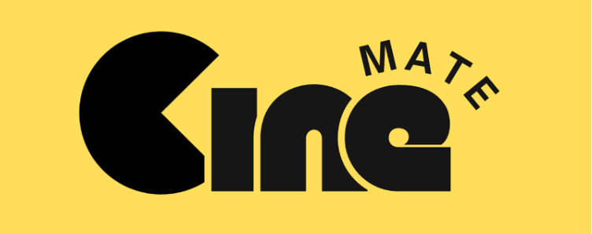
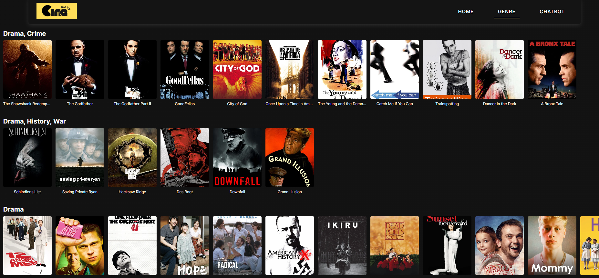
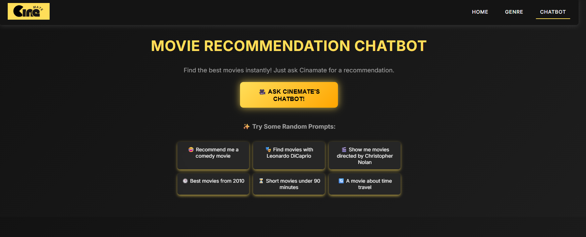
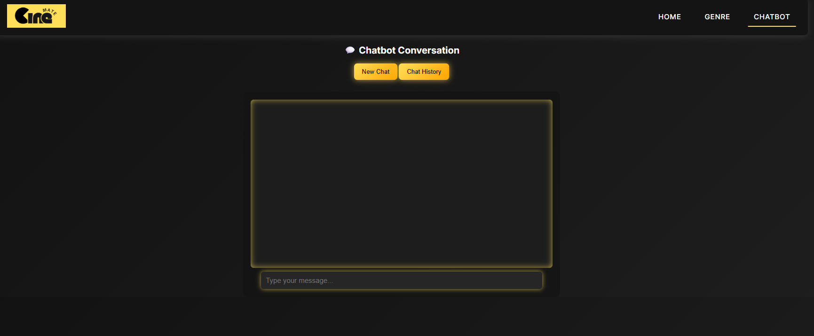

<p align="center">
  
</p>

<h1 align="center">🎬 Movie Recommendation System (RCM)</h1>
<h3 align="center">Machine Learning Course Project — Chatbot-Based Movie Recommendation</h3>

---

## 📖 Overview
This project is a **Movie Recommendation System** developed as part of the **Machine Learning** course.  
It delivers **personalized movie suggestions** through an **interactive chatbot interface**, enabling users to express their interests naturally.  

The system integrates **Content-Based Filtering**, **Collaborative Filtering**, and a **Hybrid Recommendation Model** to produce dynamic and accurate results — offering users a seamless experience from conversation to movie discovery.

---

## 💡 Key Features

### 🏠 Home Page
- Clean and intuitive UI introducing the platform.
- Easy navigation between main modules.
- Highlights project purpose and chatbot access point.

<p align="center">
  
  <br/>
  
</p>

---

### 🎭 Genre-based Recommendation
- Displays top movies filtered by user-selected genres.
- Implements **content similarity scoring** to identify relevant suggestions.
- Simple and visualized layout for quick discovery.

<p align="center">
  
</p>

---

### 💬 Chatbot Interaction
- Users can **chat in natural language** to get recommendations.
- Uses **Natural Language Processing (NLP)** to understand user intent.
- Real-time responses featuring the most relevant movies.
- Interactive and engaging conversational flow.

<p align="center">
  
</p>

---

### 💬 New Chat Interface
- Redesigned chatbot interface for a **smoother and more user-friendly experience**.
- Enhanced scrolling, responsiveness, and modern look.
- Better readability and visual hierarchy.

<p align="center">
  
</p>

---

## ⚙️ Technology Stack

| Category | Tools / Libraries |
|-----------|------------------|
| **Frontend** | HTML, CSS, JavaScript |
| **Backend** | Python (Flask) |
| **Machine Learning** | scikit-learn, pandas, numpy |
| **NLP** | NLTK / spaCy (for text processing) |
| **Dataset** | MovieLens Dataset |
| **Visualization / Testing** | Matplotlib, Jupyter Notebook |

---

## 🧩 System Workflow

1. **User Interaction** – The chatbot collects user preferences and movie interests.  
2. **Data Preprocessing** – Extracts key features like genres, keywords, and ratings.  
3. **Recommendation Engine** – Generates recommendations using:
   - 🎯 Content-Based Filtering  
   - 👥 Collaborative Filtering  
   - 🔗 Hybrid Model  
4. **Response Generation** – Displays ranked movie suggestions directly in the chatbot.  

<p align="center">
  
</p>

---

## 🚀 How to Run the Project

### 🔧 Requirements
Make sure you have installed:
- Python 3.8+
- pip

### 📦 Installation
```bash
git clone https://github.com/TheHien04/Movie-Recommendation-System-RCM.git
cd Movie-Recommendation-System-RCM
pip install -r requirements.txt
