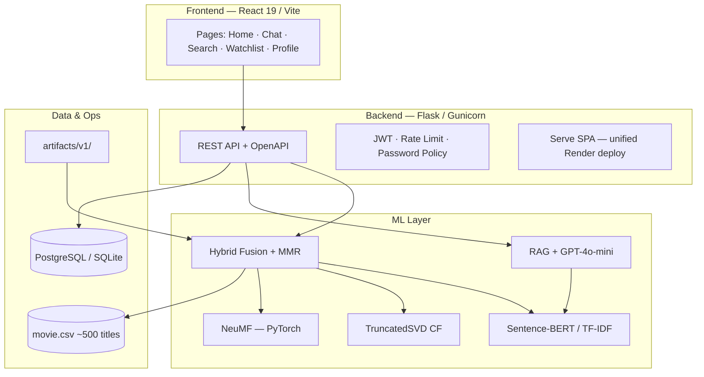

# Cinemate — Hệ thống Gợi ý Phim Thông minh (Hybrid ML + RAG)

[](https://github.com/TheHien04/Movie-Recommendation-System-RCM-/actions/workflows/ci.yml)
[](LICENSE)
[](https://www.python.org/)
[](https://react.dev/)

> **Đồ án môn Machine Learning** — Nền tảng full-stack gợi ý phim kết hợp **Content-Based Filtering**, **Collaborative Filtering**, **Neural Collaborative Filtering (NeuMF)**, **Hybrid Ensemble**, **RAG** và **cá nhân hóa theo hành vi người dùng**.

| | Link |
|---|---|
| **Live Demo (Render)** | [https://cinemate-live.onrender.com](https://cinemate-live.onrender.com) |
| **GitHub Pages** | [https://thehien04.github.io/Movie-Recommendation-System-RCM-/](https://thehien04.github.io/Movie-Recommendation-System-RCM-/) |
| **Repository** | [TheHien04/Movie-Recommendation-System-RCM-](https://github.com/TheHien04/Movie-Recommendation-System-RCM-) |

---

## Mục lục

1. [Tóm tắt đồ án](#1-tóm-tắt-đồ-án)
2. [Bài toán & mục tiêu](#2-bài-toán--mục-tiêu)
3. [Kiến trúc hệ thống](#3-kiến-trúc-hệ-thống)
4. [Pipeline Machine Learning](#4-pipeline-machine-learning)
5. [Đánh giá mô hình](#5-đánh-giá-mô-hình)
6. [Demo giao diện — theo luồng người dùng](#6-demo-giao-diện--theo-luồng-người-dùng)
7. [Công nghệ sử dụng](#7-công-nghệ-sử-dụng)
8. [Cài đặt & chạy local](#8-cài-đặt--chạy-local)
9. [Triển khai Production](#9-triển-khai-production)
10. [Tài liệu kỹ thuật](#10-tài-liệu-kỹ-thuật)

---

## 1. Tóm tắt đồ án

**Cinemate** là hệ thống gợi ý phim end-to-end: người dùng mô tả sở thích bằng ngôn ngữ tự nhiên (chat, tìm kiếm, mood), hệ thống **truy xuất – xếp hạng – đa dạng hóa** danh sách phim từ catalog ~500 tiêu đề, đồng thời **học từ watchlist, rating và hành vi duyệt** khi đăng nhập.

Điểm khác biệt so với demo ML thông thường:

- **Hybrid v3** — kết hợp Sentence-BERT, SVD, NeuMF (PyTorch), rule NLP và MMR
- **RAG** — truy xuất ngữ nghĩa + sinh câu trả lời (GPT-4o-mini, tùy chọn)
- **A/B Testing** — so sánh Hybrid vs RAG trên cùng query
- **MLOps** — train script, artifacts versioned, model card, CI gate NDCG
- **Production** — JWT, Postgres, Docker, Render unified deploy, 42+ automated tests

---

## 2. Bài toán & mục tiêu

### 2.1 Bài toán

Cho tập phim \( \mathcal{M} \) và truy vấn người dùng \( q \) (text), tìm tập \( TopK \subset \mathcal{M} \) tối đa hóa **relevance** và **diversity**, có thể kèm ràng buộc genre / diễn viên / đạo diễn.

### 2.2 Mục tiêu đồ án

| STT | Mục tiêu | Trạng thái |
|-----|----------|------------|
| 1 | Xây dựng pipeline CBF (TF-IDF / Transformer embeddings) | ✅ |
| 2 | Collaborative Filtering (TruncatedSVD) | ✅ |
| 3 | Neural CF — NeuMF huấn luyện PyTorch | ✅ |
| 4 | Hybrid fusion + hyperparameter tuning (NDCG@5) | ✅ |
| 5 | RAG conversational recommendations | ✅ |
| 6 | Đánh giá định lượng (NDCG, Precision, Recall, MAP) | ✅ |
| 7 | Ứng dụng web full-stack + triển khai cloud | ✅ |
| 8 | Cá nhân hóa từ rating / watchlist / events | ✅ |

---

## 3. Kiến trúc hệ thống



**Luồng gợi ý chính:** `User Query` → NLP extract rules → song song semantic / CF / neural scores → weighted fusion → MMR diversity → JSON + explainability.

---

## 4. Pipeline Machine Learning

```
Dataset (movie.csv)
    │
    ├─► Validation & feature engineering (genre, cast, overview text)
    │
    ├─► Content-Based: TF-IDF hoặc all-MiniLM-L6-v2 embeddings
    │
    ├─► Collaborative: TruncatedSVD trên ma trận genre-user
    │
    ├─► Neural CF: NeuMF (GMF + MLP), BCE loss, Adam
    │
    ├─► Hyperopt: grid-search trọng số fusion (objective = NDCG@5)
    │
    └─► Export artifacts/v1/ + manifest.json
```

Huấn luyện:

```bash
cd Movie_Recommend_System/backend
python scripts/train_models.py
```

Chi tiết mô hình: [MODEL_CARD.md](MODEL_CARD.md)

---

## 5. Đánh giá mô hình

| Metric | Hybrid v3 | Ghi chú |
|--------|-----------|---------|
| **NDCG@5** | ~0.11 | 20 test cases có nhãn, benchmark nội bộ |
| **Precision@5** | ~0.07 | |
| **Recall@5** | ~0.09 | |
| **MAP** | ~0.07 | |

- Benchmark: `Movie_Recommend_System/data/test_cases.json`
- CI gate: `MIN_AVG_NDCG = 0.10` — `pytest tests/test_eval_gate.py`
- Báo cáo đầy đủ: [RESULTS.md](RESULTS.md)

> *Lưu ý học thuật:* catalog ~500 phim — metric mang tính **tương đối** để so sánh ablation (CBF vs Hybrid vs RAG), không so sánh trực tiếp với hệ thống industrial scale.

---

## 6. Demo giao diện — theo luồng người dùng

### 6.1 Trang chủ — Khám phá & gợi ý ban đầu

Trang chủ tổng hợp **trending**, **personalized feed** (khi đăng nhập), **random picks** và lối tắt vào chat AI.

| | |
|:---:|:---:|
| Hero & navigation | Trending + personalized rails |
|  |  |


---

### 6.2 AI Chat — Hybrid ML & RAG

Người dùng chat bằng ngôn ngữ tự nhiên. Hệ thống chạy **Hybrid v3** (variant A) hoặc **RAG** (variant B), hiển thị poster, điểm số và feedback 👍/👎 cho A/B analytics. Lịch sử chat **đồng bộ cloud** khi đăng nhập.


---

### 6.3 Tìm kiếm ngữ nghĩa & lọc nâng cao

**Semantic search** (Sentence-BERT) kết hợp bộ lọc genre, năm, rating tối thiểu.


---

### 6.4 Duyệt theo thể loại & Mood

- **Genres** — browse catalog theo nhóm thể loại
- **Moods** — chip cảm xúc → query hybrid được chuẩn hóa sẵn

| | |
|:---:|:---:|
|  |  |

---

### 6.5 Chi tiết phim, Watchlist & Profile

- **Watchlist** — lưu local + sync cloud, export/share URL
- **Profile** — đăng ký/đăng nhập JWT, thống kê watchlist/ratings/chat
- **Rating** — đánh sao ảnh hưởng trực tiếp tới personalization pipeline

| | |
|:---:|:---:|
|  |  |

---

### 6.6 So sánh mô hình & phân tích ML

| Tính năng | Mô tả ML |
|-----------|----------|
| **ML Battle** | Side-by-side Hybrid v3 vs RAG trên cùng query |
| **Compare** | Ma trận similarity cosine giữa 2–3 phim |
| **Leaderboard** | Top IMDb, lọc genre — baseline popularity |

| | |
|:---:|:---:|
|  |  |


---

## 7. Công nghệ sử dụng

| Tầng | Công nghệ |
|------|-----------|
| **Frontend** | React 19, TypeScript, Vite 8, Tailwind CSS 4, PWA |
| **Backend** | Flask, SQLAlchemy, JWT, Gunicorn, OpenAPI 3.0 |
| **ML / AI** | scikit-learn, Sentence-Transformers, PyTorch (NeuMF), OpenAI API |
| **Database** | PostgreSQL (production), SQLite (dev) |
| **DevOps** | GitHub Actions, Docker, Render Blueprint, GitHub Pages |
| **Testing** | pytest (42+), Vitest, Playwright E2E |

---

## 8. Cài đặt & chạy local

### Yêu cầu

- Python 3.11+
- Node.js 22+
- (Tuỳ chọn) `TMDB_API_KEY`, `OPENAI_API_KEY`

### Backend

```bash
cd Movie_Recommend_System/backend
python3 -m venv .venv && source .venv/bin/activate
pip install -r ../../requirements.txt
cp .env.example .env          # chỉnh SECRET_KEY, TMDB_API_KEY
python scripts/train_models.py
python app.py                 # http://127.0.0.1:5001
```

### Frontend

```bash
cd Movie_Recommend_System/web
npm install && npm run dev    # http://127.0.0.1:5173
```

### Chạy tests

```bash
# Backend
cd Movie_Recommend_System/backend
pytest -q --cov=app --cov-fail-under=45

# Frontend
cd Movie_Recommend_System/web
npm run lint && npm run test && npm run build

# Docker
docker compose up --build
```

---

## 9. Triển khai Production

| Môi trường | URL | Ghi chú |
|------------|-----|---------|
| **Render (khuyến nghị)** | [cinemate-live.onrender.com](https://cinemate-live.onrender.com) | API + SPA cùng origin, Postgres tự provision |
| **GitHub Pages** | [thehien04.github.io/.../](https://thehien04.github.io/Movie-Recommendation-System-RCM-/) | Static mirror, gọi API Render |

**Checklist triển khai:** xem [DEPLOY.md](DEPLOY.md)

```bash
# Render: connect repo → Manual Sync render.yaml
# Set secrets: TMDB_API_KEY, OPENAI_API_KEY (optional)

# Verify
curl https://cinemate-live.onrender.com/api/health/ready
```

---

## 10. Tài liệu kỹ thuật

| Tài liệu | Nội dung |
|----------|----------|
| [MODEL_CARD.md](MODEL_CARD.md) | Kiến trúc mô hình, training, limitations |
| [RESULTS.md](RESULTS.md) | Benchmark NDCG, personalization |
| [DEPLOY.md](DEPLOY.md) | Hướng dẫn deploy Render / GH Pages |
| [SECURITY.md](SECURITY.md) | Chính sách bảo mật |
| [CONTRIBUTING.md](CONTRIBUTING.md) | Quy trình phát triển |

### API chính

| Endpoint | Mô tả |
|----------|-------|
| `POST /recommend` | Hybrid hoặc RAG recommendations |
| `GET /api/search?q=` | Semantic search |
| `GET /api/personalized` | Feed cá nhân hoá (JWT) |
| `GET /api/ml/evaluate` | Offline benchmark |
| `GET /api/ml/explain/<title>` | Score breakdown |
| `POST /api/v1/recommend` | B2B API (`X-API-Key`) |
| `GET /api/health/ready` | Readiness probe |

### Cấu trúc thư mục

```
Movie_Recommend_System/
├── backend/          # Flask API, ML modules, artifacts/
│   ├── app/ml/       # hybrid, ncf, embeddings, metrics
│   ├── artifacts/v1/ # model manifest & weights
│   └── scripts/      # train_models.py
├── web/              # React frontend (active)
├── data/             # test_cases.json — eval benchmark
├── frontend/         # Legacy UI (archived)
└── notebooks/        # ML experiments
Image/                  # Screenshots — README demo
Report/                 # Báo cáo đồ án
```

---

## Tác giả

**TheHien04** — Machine Learning Course Project  
Repository: [github.com/TheHien04/Movie-Recommendation-System-RCM-](https://github.com/TheHien04/Movie-Recommendation-System-RCM-)

## License

MIT — xem [LICENSE](LICENSE)
