# Cinemate

Intelligent movie recommendation platform combining content-based filtering, collaborative filtering, neural collaborative filtering (NeuMF), hybrid ensemble ranking, retrieval-augmented generation (RAG), and behavioral personalization.

[](https://github.com/TheHien04/Movie-Recommendation-System-RCM-/actions/workflows/ci.yml)

**Live demo:** [cinemate-live.onrender.com](https://cinemate-live.onrender.com)  
**Static mirror:** [thehien04.github.io/Movie-Recommendation-System-RCM-](https://thehien04.github.io/Movie-Recommendation-System-RCM-/)  
**Source:** [github.com/TheHien04/Movie-Recommendation-System-RCM-](https://github.com/TheHien04/Movie-Recommendation-System-RCM-)

---

## Table of contents

1. [Overview](#overview)
2. [Problem statement](#problem-statement)
3. [System architecture](#system-architecture)
4. [Machine learning pipeline](#machine-learning-pipeline)
5. [Evaluation](#evaluation)
6. [Product walkthrough](#product-walkthrough)
7. [Technology stack](#technology-stack)
8. [Local development](#local-development)
9. [Deployment](#deployment)
10. [Documentation](#documentation)
11. [Security](#security)

---

## Overview

Cinemate is a production-oriented machine learning capstone: users express preferences in natural language (chat, search, mood filters), and the system retrieves, ranks, and diversifies recommendations from a catalog of approximately 500 titles. For authenticated users, watchlist entries, star ratings, and browse events feed back into the ranking pipeline.

**Core capabilities**

| Capability | Description |
|------------|-------------|
| Hybrid v3 | Sentence-BERT retrieval, TruncatedSVD CF, NeuMF (PyTorch), rule-based NLP, MMR diversification |
| RAG | Semantic retrieval with optional GPT-4o-mini answer generation |
| A/B testing | Variant assignment for Hybrid vs RAG |
| Personalization | User signals (watchlist, ratings, events) influence hybrid seeds and genre weights |
| MLOps | Versioned artifacts, training script, model card, offline NDCG gate in CI |
| Platform | JWT auth, rate limiting, PostgreSQL (production), Docker, unified Render deploy |

---

## Problem statement

Given a movie catalog \(\mathcal{M}\) and a user query \(q\) (natural language text), return a ranked subset \(TopK \subset \mathcal{M}\) that maximizes relevance and diversity, optionally constrained by genre, cast, or director metadata.

**Project objectives**

| # | Objective | Status |
|---|-----------|--------|
| 1 | Content-based filtering (TF-IDF / transformer embeddings) | Complete |
| 2 | Matrix factorization collaborative filtering (TruncatedSVD) | Complete |
| 3 | Neural collaborative filtering (NeuMF, PyTorch) | Complete |
| 4 | Hybrid fusion with hyperparameter tuning (NDCG@5) | Complete |
| 5 | RAG-based conversational recommendations | Complete |
| 6 | Quantitative evaluation (NDCG, Precision, Recall, MAP) | Complete |
| 7 | Full-stack web application and cloud deployment | Complete |
| 8 | Behavioral personalization (ratings, watchlist, events) | Complete |

---

## System architecture

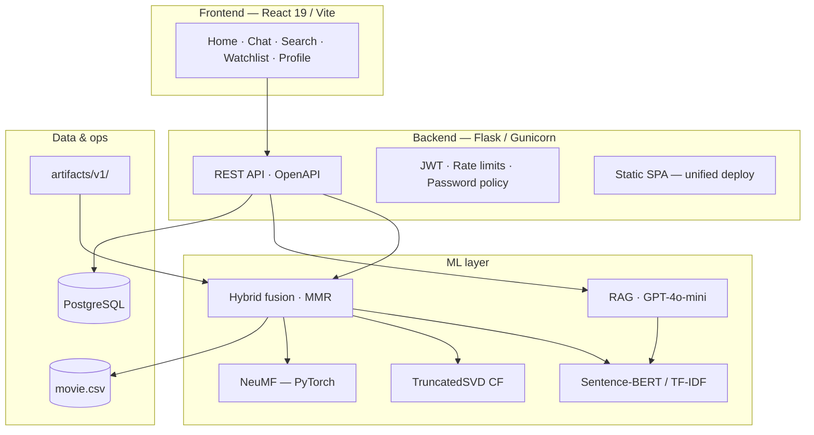

**Recommendation flow:** parse query and extract constraints → score candidates via semantic, collaborative, and neural channels → weighted fusion → MMR re-ranking → response with explainability metadata.

---

## Machine learning pipeline

```
movie.csv
  → schema validation & text feature engineering
  → content embeddings (TF-IDF or all-MiniLM-L6-v2)
  → SVD item factors (genre-user matrix)
  → NeuMF training (implicit personas, BCE loss)
  → grid search fusion weights (maximize NDCG@5)
  → export artifacts/v1/ + manifest.json
```

Train locally:

```bash
cd Movie_Recommend_System/backend
python scripts/train_models.py
```

Model documentation: [MODEL_CARD.md](MODEL_CARD.md)

---

## Evaluation

Offline benchmark on 20 labeled queries (`Movie_Recommend_System/data/test_cases.json`).

| Metric | Hybrid v3 |
|--------|-----------|
| NDCG@5 | ~0.11 |
| Precision@5 | ~0.07 |
| Recall@5 | ~0.09 |
| MAP | ~0.07 |

Reproduce:

```bash
cd Movie_Recommend_System/backend
pytest tests/test_eval_gate.py -q
# or: curl http://127.0.0.1:5001/api/ml/evaluate
```

Full report: [RESULTS.md](RESULTS.md)

Metrics are relative to this catalog size and benchmark set; they support ablation and regression testing rather than industrial-scale comparison.

---

## Product walkthrough

Screenshots follow the primary user journey: discover → query → refine → save → analyze.

### Home — discovery and personalized rails

Landing page with trending titles, personalized recommendations (authenticated), and entry points into AI chat.

| | |
|:---:|:---:|
| 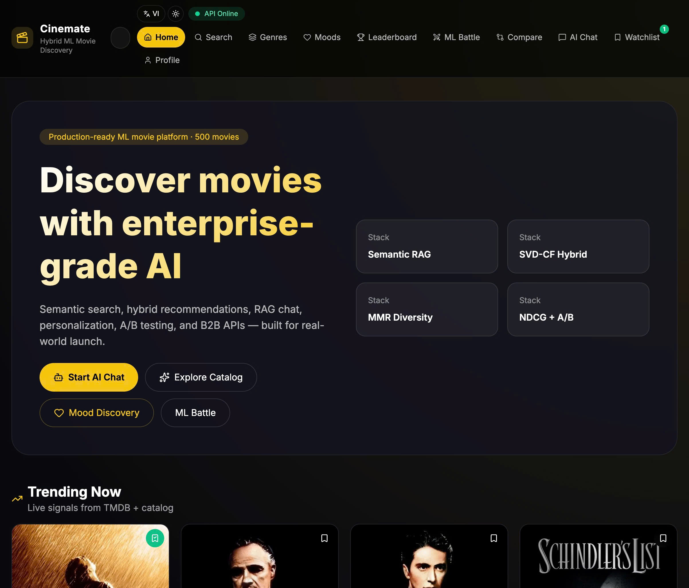 | 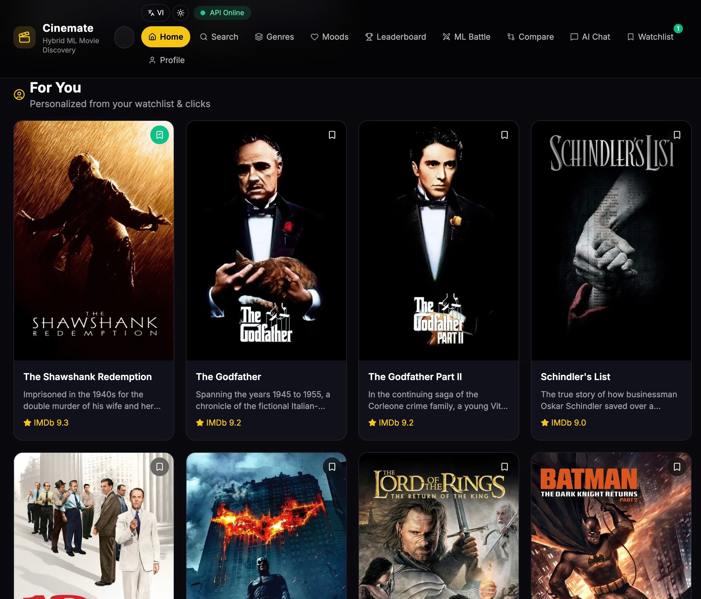 |

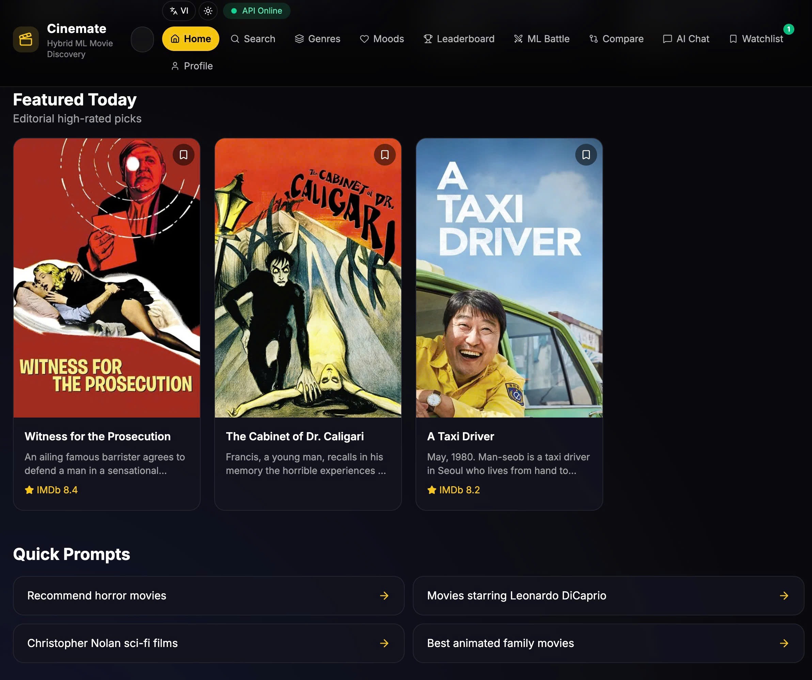

### AI chat — Hybrid ML and RAG

Natural-language queries routed to Hybrid v3 (variant A) or RAG (variant B). Results include posters, scores, and optional thumbs feedback. Chat history syncs to the user account when signed in.

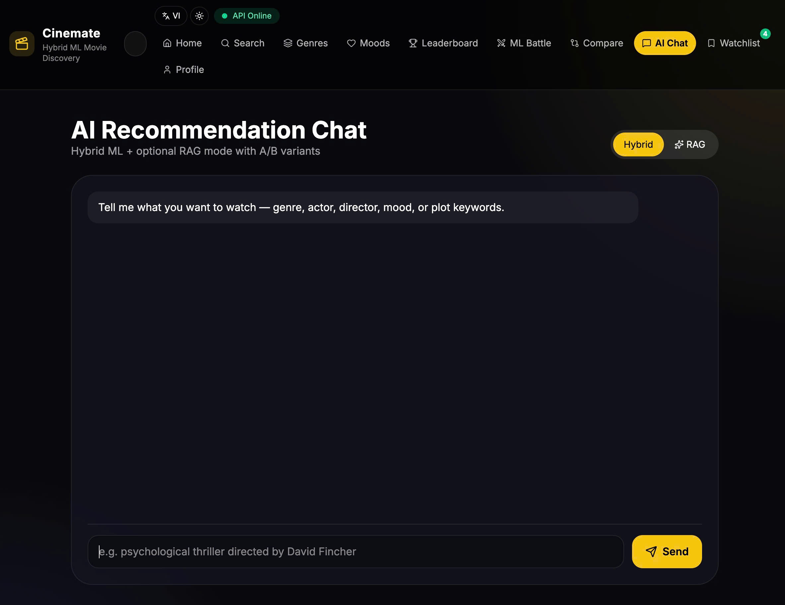

### Search — semantic retrieval and filters

Sentence-BERT search with advanced filters (genre, year, minimum rating).

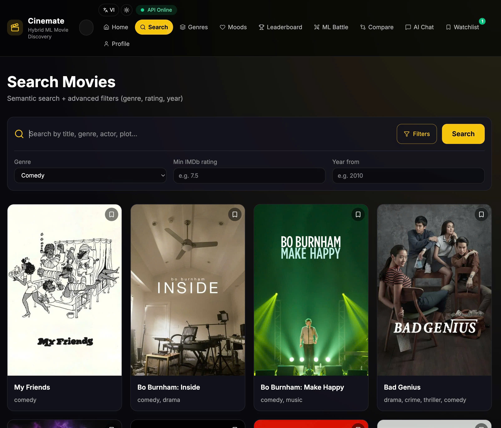

### Browse — genres and moods

Genre browsing and mood-based recommendation shortcuts mapped to hybrid queries.

| | |
|:---:|:---:|
| 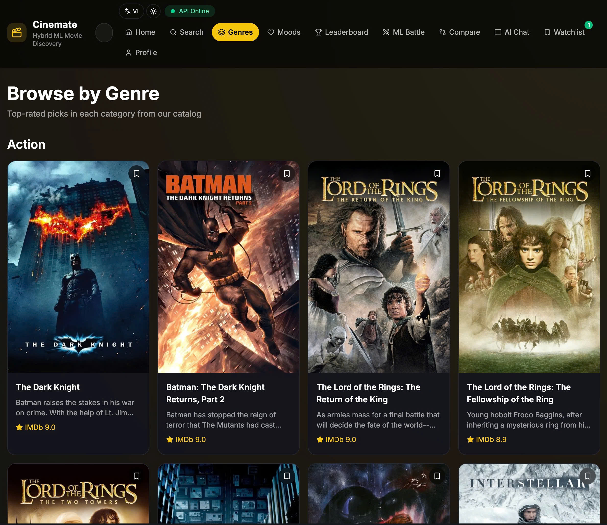 | 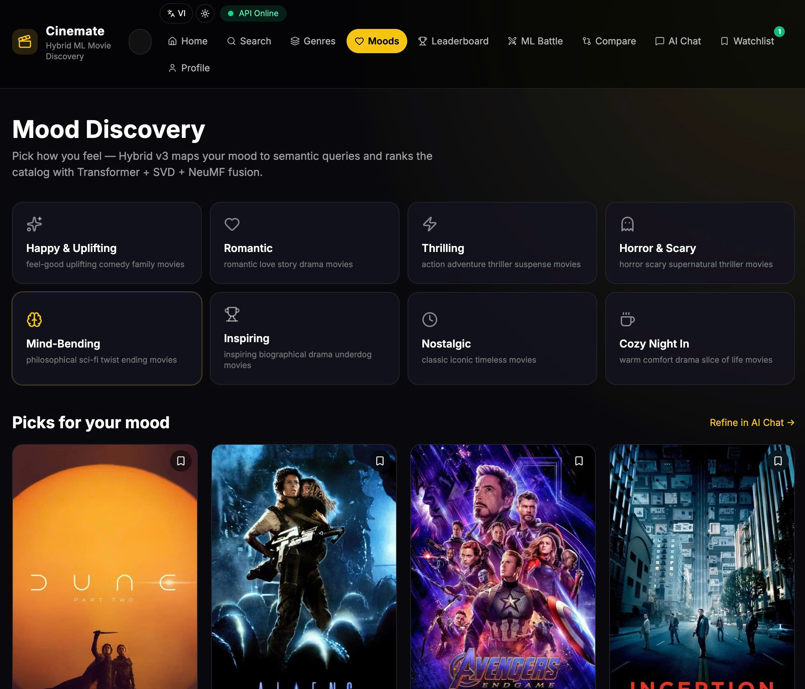 |

### Watchlist and profile

Local-first watchlist with cloud sync, JWT authentication, and usage statistics. Star ratings feed the personalization pipeline.

| | |
|:---:|:---:|
| 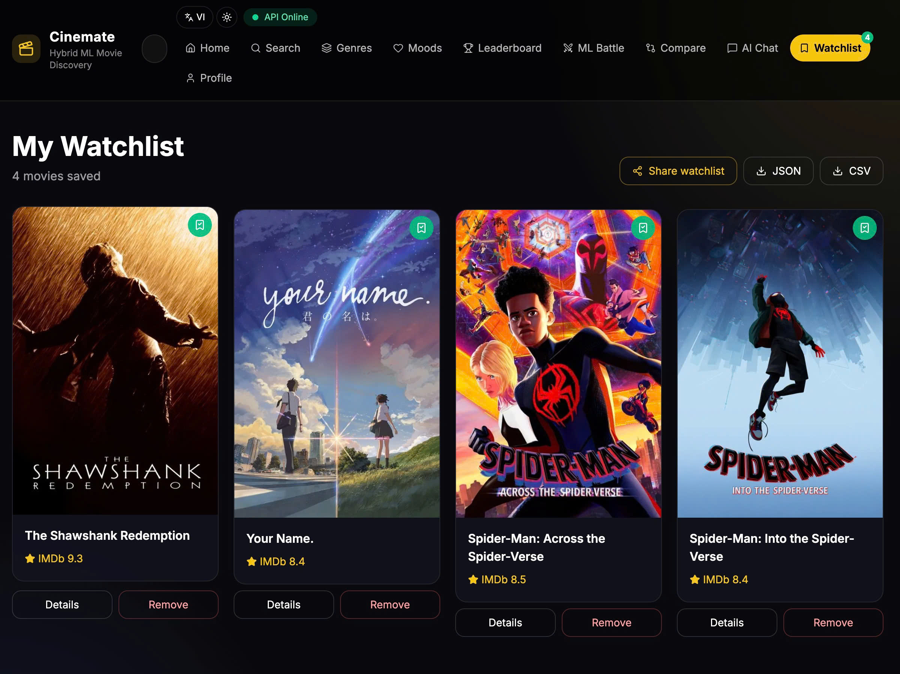 | 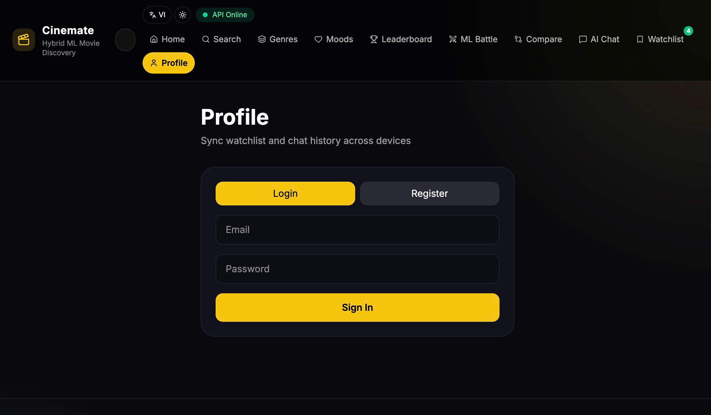 |

### ML analysis — model comparison and ranking

| Feature | Purpose |
|---------|---------|
| ML Battle | Side-by-side Hybrid v3 vs RAG on the same query |
| Compare | Cosine similarity matrix across 2–3 titles |
| Leaderboard | Top-rated titles with genre filter |

| | |
|:---:|:---:|
| 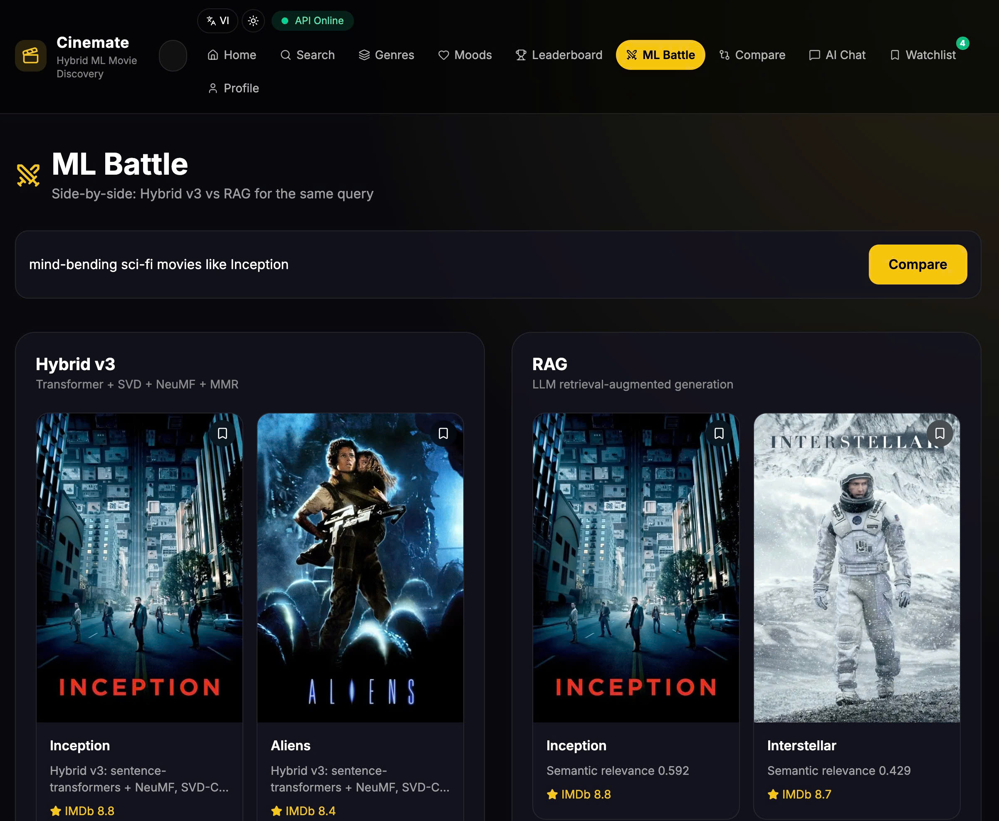 | 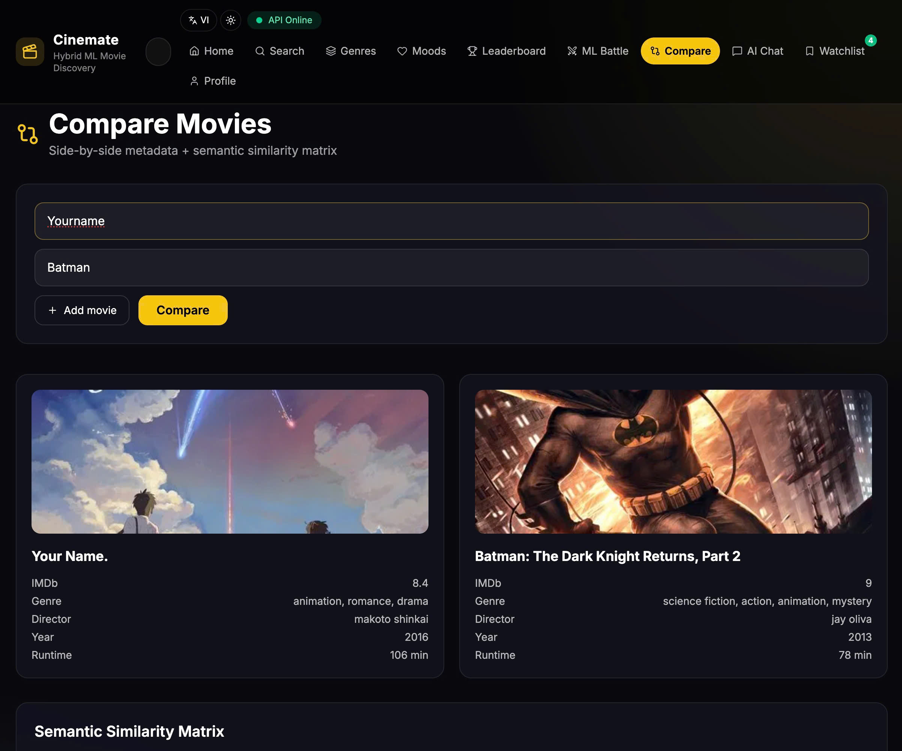 |

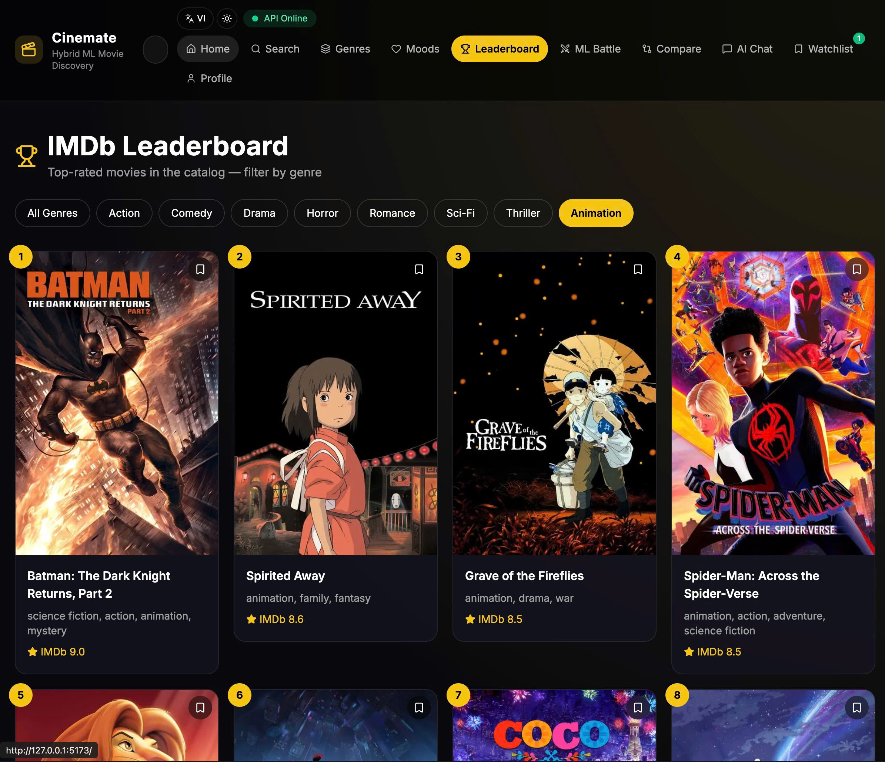

---

## Technology stack

| Layer | Technologies |
|-------|----------------|
| Frontend | React 19, TypeScript, Vite 8, Tailwind CSS 4 |
| Backend | Flask, SQLAlchemy, JWT, Gunicorn, OpenAPI 3.0 |
| ML / AI | scikit-learn, Sentence-Transformers, PyTorch (NeuMF), OpenAI API |
| Data | PostgreSQL (production), SQLite (development) |
| DevOps | GitHub Actions, Docker, Render Blueprint, GitHub Pages |
| Testing | pytest (42+), Vitest, Playwright E2E |

---

## Local development

**Requirements:** Python 3.11+, Node.js 22+. Optional: `TMDB_API_KEY`, `OPENAI_API_KEY`.

```bash
# Backend
cd Movie_Recommend_System/backend
python3 -m venv .venv && source .venv/bin/activate
pip install -r ../../requirements.txt
cp .env.example .env    # set secrets locally — never commit .env
python scripts/train_models.py
python app.py           # http://127.0.0.1:5001

# Frontend
cd Movie_Recommend_System/web
npm install && npm run dev   # http://127.0.0.1:5173
```

**Tests**

```bash
cd Movie_Recommend_System/backend && pytest -q --cov=app --cov-fail-under=45
cd Movie_Recommend_System/web && npm run lint && npm run test && npm run build
docker compose up --build
```

---

## Deployment

| Environment | URL | Notes |
|-------------|-----|-------|
| Render (recommended) | [cinemate-live.onrender.com](https://cinemate-live.onrender.com) | Unified API + SPA; Postgres via `render.yaml` |
| GitHub Pages | [thehien04.github.io/.../](https://thehien04.github.io/Movie-Recommendation-System-RCM-/) | Static frontend; API on Render |

Deploy checklist: [DEPLOY.md](DEPLOY.md)

```bash
# After connecting the repo on Render: Manual Sync render.yaml
# Set TMDB_API_KEY (required) and OPENAI_API_KEY (optional) in the dashboard

curl https://cinemate-live.onrender.com/api/health/ready
```

---

## Documentation

| Document | Contents |
|----------|----------|
| [MODEL_CARD.md](MODEL_CARD.md) | Model architecture, training, limitations |
| [RESULTS.md](RESULTS.md) | Benchmark metrics, personalization |
| [DEPLOY.md](DEPLOY.md) | Production deployment |
| [SECURITY.md](SECURITY.md) | Security policy and controls |
| [CONTRIBUTING.md](CONTRIBUTING.md) | Development workflow |

**Key API endpoints**

| Endpoint | Description |
|----------|-------------|
| `POST /recommend` | Hybrid or RAG recommendations |
| `GET /api/search?q=` | Semantic search |
| `GET /api/personalized` | Personalized feed (JWT) |
| `GET /api/ml/evaluate` | Offline benchmark |
| `GET /api/ml/explain/<title>` | Score breakdown |
| `POST /api/v1/recommend` | B2B API (`X-API-Key`) |
| `GET /api/health/ready` | Readiness probe |

**Repository layout**

```
Movie_Recommend_System/
├── backend/          # Flask API, ML modules, artifacts/
├── web/              # React frontend
├── data/             # Evaluation test cases
├── frontend/         # Legacy UI (archived)
└── notebooks/        # ML experiments
Image/                  # Product screenshots
Report/                 # Written report (thesis)
```

---

## Security

This repository is configured to exclude secrets and local databases from version control (`.env`, `cinemate.db`, keys). Production secrets (`SECRET_KEY`, `ADMIN_API_KEY`, `TMDB_API_KEY`, `OPENAI_API_KEY`, `DATABASE_URL`) must be set only in your hosting provider's environment.

Do not commit:

- `.env` or any file containing API keys or passwords
- SQLite database files (`cinemate.db`)
- Private keys (`.pem`, `.key`)

See [SECURITY.md](SECURITY.md) for the full security policy.

---

## Author

**TheHien04** — Machine Learning course capstone project

## License

MIT. See [LICENSE](LICENSE).
